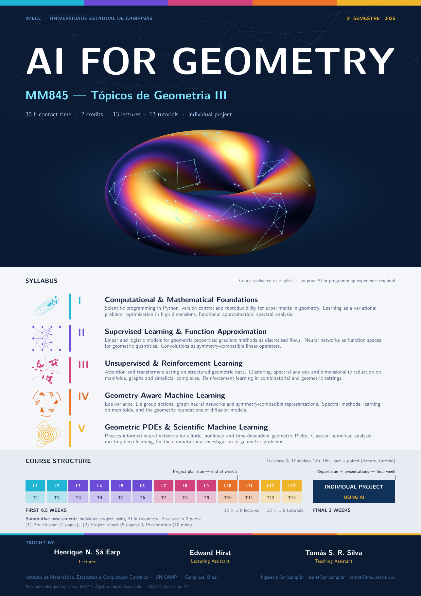

# AI for Geometry

**MM845 — Tópicos de Geometria III**
IMECC · Universidade Estadual de Campinas · 2º semestre 2026

30 h contact time · 2 credits · 13 lectures + 13 tutorials · individual project

Course delivered in English. No prior AI or programming experience required.

This repository holds the lecture slides and tutorial materials for the course.

- [`slides/`](slides/) — lecture slides and the course poster
- [`tutorial_1/`](tutorial_1/) — [Setting Up Your Working Environment](tutorial_1/README.md)

**Taught by** Henrique N. Sá Earp (Lecturer) · Edward Hirst (Lecturing Assistant) · Tomás S. R. Silva (Teaching Assistant)

---

*[Download the poster as PDF](slides/AI_course_poster.pdf)*
